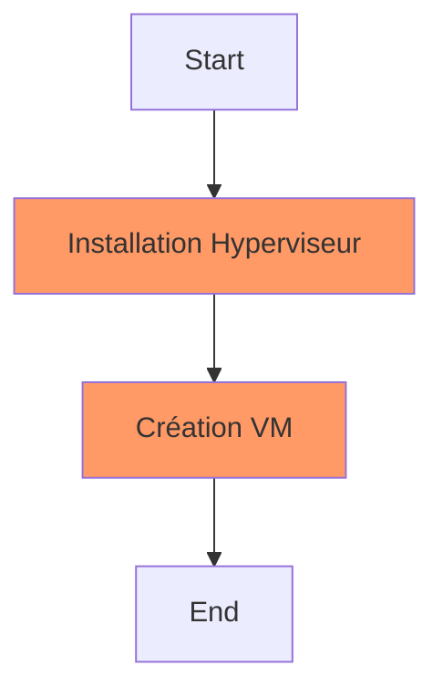
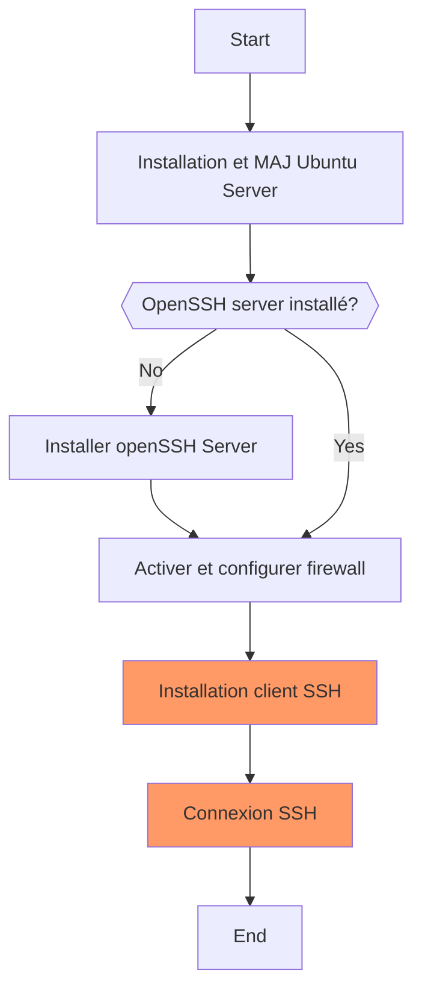
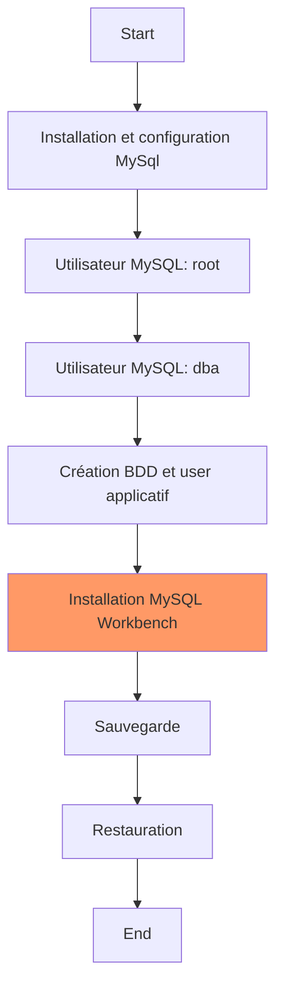
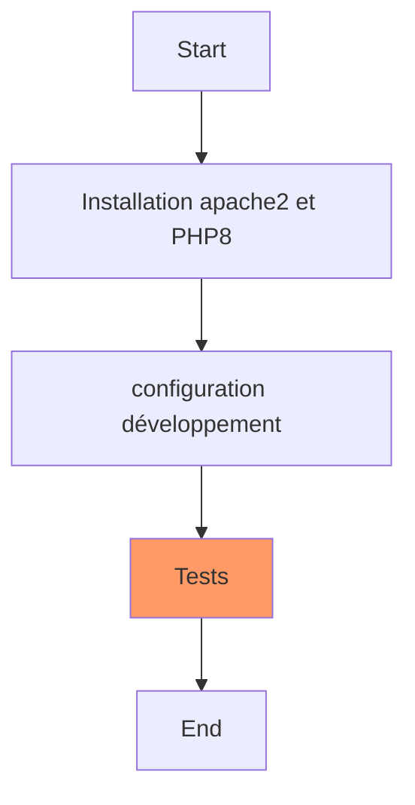
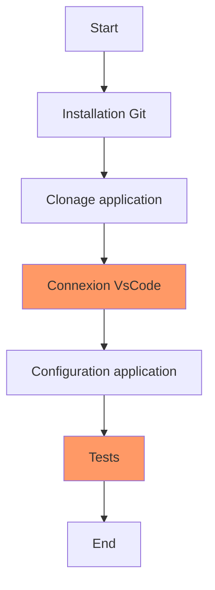

# FLOPSECURITY

- @ Processus d'installation
- A Installation d'un Hyperviseur et création d'une machine virtuelle
  - A1 Installation hyperviseur
  - A2 Création machine virtuelle
- B Installation Ubuntu Server
    - B1 Installation
    - B2 Mise à jour du système
    - B3 Installation / vérification openSSH server
    - B4 Installation d'un client SSH sur le Host (optionnel)
    - B5 Connexion SSH
    - B6 Configuration firewall
- C Installation et configuration de MySQL
  - C1 Installation MySql et test de l'installation
  - C2 Première connexion au serveur MySQL
  - C3 Configuration du serveur MySQL
  - C4 Utilisateur MySQL: root
  - C5 Utilisateur MySQL: dba
  - C6 Création de la base de données et de l'utilisateur applicatif
  - C7 Test de la base de données applicative
  - C8 Installation MySQL Workbench
  - C9 Sauvegarde de toutes les bases de données
  - C10 Sauvegarde de la base de données flopsecurity
  - C11 Restauration de la base de données flopsecurity
- D Installation apache 2 et PHP 8
  - D1 Installation des paquets
  - D2 Configuration PHP développement  
  - D3 Vérification de la configuration de PHP  
- E Installation de l'application flopsecurity
  - E1 Installation de Git sur le serveur LAMP
  - E2 Clonage de l'application
  - E3 test accès à l'application flopsecurity
  - E4 Connexion à partir de VS Code
  - E5 configuration de l'application flopsecurity
- F Test de la sécurité de l'application
  - F1 Premières requètes SQL
  - F2 Réalisation d'une injection SQL
  - F3 Réalisation d'une attaque XSS
  - F4 Ecrire en Python un brute Force
  - F5 Automatiser toutes les étapes précédentes
- G Réalisation d'un audit de sécurité
- H préconisations pour sécuriser un serveur de production
  - H1 Sécurisation du système Linux
  - H2 Accès au serveur par SSH
  - H3 Sécurisation de MySQL
  - H4 Configuration de apache2 et de PHP
  - H5 Modification de l'application
  - H6 Utilisation d'un IDS ? configuration du firewall ?
  - H7 Chiffrement SSL du serveur apache2
  - H8 Autres sécurisations possibles

**flopsecurity est une application web possédant des nombreuses failles de sécurité.**

Ce TP permet l'installation d'un serveur LAMP en version développement. Cette configuration ne peut pas être utilisée pour un serveur de production.

LAMP |
---------|
 **L**inux |
 **A**pache | 
 **M**ySQL |
 **P**HP |

## Partie A: Processus d'installation


    

## A Installation d'un Hyperviseur et création d'une machine virtuelle

- Type-1, native or bare-metal hypervisors:

These hypervisors run directly on the host's hardware to control the hardware and to manage guest operating systems. For this reason, they are sometimes called bare-metal hypervisors.

exemples: KVM, Xen, HyperV, VMware vSphere / ESXi
Utilisation : datacenter, virtualisation de serveurs

Type 1 |
---------|
 Operating System |
 Hypervisor |
 Hardware |

- Type-2 or hosted hypervisors
These hypervisors run on a conventional operating system (OS) just as other computer programs do. A virtual machine monitor runs as a process on the host. Type-2 hypervisors abstract guest operating systems from the host operating system.

exemples: VirtualBox, QEMU, Proxmox
Utilisation : développement, virtualisation d'applications/serveurs

Type 2 | Système
---------|---------
 Operating System | Guest
 Hypervisor | 
 Operating System | Host
 Hardware |

### A1 Installation hyperviseur

Solutions disponibles(liste non exhaustive):
- GNU/Linux:
  - KVM pré-installé. Ajouter virtmanager comme GUI ou virtsh en CLI.
- macOS:
  - [virtualbox](https://www.virtualbox.org/)
- Windows:
  - HyperV (disponible uniquement version pro)
  - [virtualbox](https://www.virtualbox.org/)
  - vmware (logiciel commercial)

### A2 Création machine virtuelle

Configuration de la machine virtuelle:
- 1 core ou plus
- RAM de 2 Go ou plus
- HDD 15 Go (25 Go recommandés)
- Configuration réseau bridge.

## Partie B: Processus d'installation



## B Installation Ubuntu Server 22.04

### B1 Installation
Note: plusieurs distribution sont disponibles. par exemple debian. Il est ausssi possible d'utliser ubuntu desktop 22.04 si vous souhaitez tester les applications graphiques.

Télécharger l'ISO ubuntu-22.04-live-server-amd64.iso.

- installation minimale
- pendant l'installation bien configurer le clavier en FR
- penser à cocher openssh server pour installation

### B2 Mise à jour du système

Remise à jour de tous les logiciels installés sur la distribution linux. Il est indispensable de remettre à jour votre distribution linux le plus souvent possible. Les mises à jour de sécurité sont disponbibles très rapidement.
```
$ sudo apt update && sudo apt upgrade -y
```

### B3 Installation / vérification openSSH server

- Install openssh server et vérification. Dans netstat, si le port 22 ssh est en mode LISTEN, le serveur fonctionne.
```
$ sudo apt update
$ sudo apt install net-tools
$ sudo apt install openssh-server
$ sudo systemctl status sshd
$ netstat -tulp
$ ip a
```

- Activation du firewall ufw et permission de l'acccès SSH
```bash
$ ip a
$ sudo ufw enable
$ sudo ufw allow ssh
```

- Noter l'adresse IP de la VM.
```bash
$ ip a
```

### B4 Installation d'un client SSH sur le Host (optionnel)

**Sur le host:** installation de git

[Installation de git](https://git-scm.com/)

Git permet de gérer les versions de code source. Voir autre document pour les bases de git.


### B5 Connexion SSH

**Sur le host:** par exemple avec git bash. 192.168.122.198 étant l'adresse IP de la VM. Il est aussi possible d'utiliser cmd.exe ou powershell
```bash
$ ssh fab@192.168.122.198
```

### B6 Configuration firewall

configuration du firewall puis vérification que les ports HTTP, HTTPS, SSH et MySql(port 3306) sont ouverts.

```
$ sudo ufw status
$ sudo ufw allow 3306
$ sudo ufw allow http
$ sudo ufw allow https
$ sudo ufw status verbose
Status: active
Logging: on (low)
Default: deny (incoming), allow (outgoing), disabled (routed)
New profiles: skip

To                         Action      From
--                         ------      ----
22/tcp                     ALLOW IN    Anywhere
3306                       ALLOW IN    Anywhere
80/tcp                     ALLOW IN    Anywhere
22/tcp (v6)                ALLOW IN    Anywhere (v6)
3306 (v6)                  ALLOW IN    Anywhere (v6)
80/tcp (v6)                ALLOW IN    Anywhere (v6)

```


## Partie C: Processus d'installation



## C Installation et configuration de MySQL

Il est aussi possible d'utiliser MariaDB en open source.

### C1 Installation MySql et test de l'installation

```
$ sudo apt install mysql-server
$ systemctl status mysql.service
● mysql.service - MySQL Community Server
   Loaded: loaded (/lib/systemd/system/mysql.service; enabled; vendor preset: enabled)
   Active: active (running) since Sat 2020-06-06 22:52:35 UTC; 10h ago
  Process: 1157 ExecStart=/usr/sbin/mysqld --daemonize --pid-file=/run/mysqld/mysqld.pid (code=exited, status=0/SUCCESS)
  Process: 866 ExecStartPre=/usr/share/mysql/mysql-systemd-start pre (code=exited, status=0/SUCCESS)
 Main PID: 1159 (mysqld)
    Tasks: 28 (limit: 2317)

$ mysql --version
mysql  Ver 8.0.22-0ubuntu0.20.04.3 for Linux on x86_64 ((Ubuntu))

$ sudo mysqladmin version
mysqladmin  Ver 8.0.22-0ubuntu0.20.04.3 for Linux on x86_64 ((Ubuntu))
Copyright (c) 2000, 2020, Oracle and/or its affiliates. All rights reserved.

Oracle is a registered trademark of Oracle Corporation and/or its
affiliates. Other names may be trademarks of their respective
owners.

Server version          8.0.22-0ubuntu0.20.04.3
Protocol version        10
Connection              Localhost via UNIX socket
UNIX socket             /var/run/mysqld/mysqld.sock
Uptime:                 3 min 40 sec

Threads: 2  Questions: 2  Slow queries: 0  Opens: 115  Flush tables: 3  Open tables: 36  Queries per second avg: 0.009
```

la commande mysqladmin permet de nombreuses fonctions d'administration du serveur MySQL
```
$ mysqladmin --help
```

### C2 Première connexion au serveur MySQL

Affichage des principales informations à propos du serveur MySQL. Liste des bases de données, droits d'accès attribués pendant l'installation.
 
```
$ sudo mysql
mysql> show databases;
+--------------------+
| Database           |
+--------------------+
| information_schema |
| mysql              |
| performance_schema |
| sys                |
+--------------------+
4 rows in set (0.05 sec)

mysql> show grants;
Grants for root@localhost

GRANT SELECT, INSERT, UPDATE, DELETE, CREATE, DROP, RELOAD, SHUTDOWN, PROCESS, FILE, REFERENCES, INDEX, ALTER, SHOW DATABASES, SUPER, CREATE TEMPORARY TABLES, LOCK TABLES, EXECUTE, REPLICATION SLAVE, REPLICATION CLIENT, CREATE VIEW, SHOW VIEW, CREATE ROUTINE, ALTER ROUTINE, CREATE USER, EVENT, TRIGGER, CREATE TABLESPACE, CREATE ROLE, DROP ROLE ON *.* TO `root`@`localhost` WITH GRANT OPTION 

GRANT APPLICATION_PASSWORD_ADMIN,AUDIT_ADMIN,BACKUP_ADMIN,BINLOG_ADMIN,BINLOG_ENCRYPTION_ADMIN,CLONE_ADMIN,CONNECTION_ADMIN,ENCRYPTION_KEY_ADMIN,GROUP_REPLICATION_ADMIN,INNODB_REDO_LOG_ARCHIVE,INNODB_REDO_LOG_ENABLE,PERSIST_RO_VARIABLES_ADMIN,REPLICATION_APPLIER,REPLICATION_SLAVE_ADMIN,RESOURCE_GROUP_ADMIN,RESOURCE_GROUP_USER,ROLE_ADMIN,SERVICE_CONNECTION_ADMIN,SESSION_VARIABLES_ADMIN,SET_USER_ID,SHOW_ROUTINE,SYSTEM_USER,SYSTEM_VARIABLES_ADMIN,TABLE_ENCRYPTION_ADMIN,XA_RECOVER_ADMIN ON *.* TO `root`@`localhost` WITH GRANT OPTION

GRANT PROXY ON ''@'' TO 'root'@'localhost' WITH GRANT OPTION

3 rows in set (0.00 sec)

mysql> exit
```

### C3 Configuration du serveur MySQL

Activation des logs de MySQL et permettre l'accès au serveur MySQL depuis l'extérieur

Activer tous les logs sur notre base de données. Cela nous permettra d'avoir un suivi de ce qu'il se passe sur le serveur. Ces options sont utiles sur des machines de développement. Notament: cela permettra de détecter des erreurs de conceptions de l'application.

Activer les logs dans les cas suivants:
- le log principal dans /var/log/mysql/mysql.log
- le slow query log pour indiquer toutes les requetes prennant plus de 2 secondes 
- les requetes n'utilisant pas d'indexes. 

Nous autorisons aussi l'accès au serveur MySQL hors de la VM (à partir du guest). les paramètres bind-address permmetent à des applications installées sur la machine host puissent accéder à la base de données. Accès possible aussi par le LAN.

> Pour ma part, j'utilise l'editeur vi. Vous pouvez remplacer vi par nano qui est probablement plus simple pour une première approche du système Linux.


```
$ sudo vi /etc/mysql/mysql.conf.d/mysqld.cnf
#
# * Logging and Replication
#
# Both location gets rotated by the cronjob.
# Be aware that this log type is a performance killer.
general_log_file        = /var/log/mysql/mysql.log
general_log             = 1
#
# Error log - should be very few entries.
#
log_error = /var/log/mysql/error.log
#
# Here you can see queries with especially long duration
slow_query_log          = 1
slow_query_log_file     = /var/log/mysql/mysql-slow.log
long_query_time = 2
log-queries-not-using-indexes

bind-address            = 0.0.0.0
mysqlx-bind-address     = 0.0.0.0


$ sudo systemctl restart mysql.service

$ cd /var/log/mysql
$ ls -ltr
-rw-r----- 1 mysql mysql  178 Dec 14 00:55 query.log
-rw-r----- 1 mysql mysql  178 Dec 14 00:55 mysql-slow.log
-rw-r----- 1 mysql adm   5929 Dec 14 00:55 error.log
```

### C4 Utilisateur MySQL: root

Par défaut, mysql crée un utilisateur root qui n'a pas de mot de passe. Habituellement, nous n'utilisons pas le user root pour se connecter à la base de données. C'est un choix pas très sûr de conserver les accès root sur le serveur MySQL. Pour cet exercice, nous conserverons les accès root dans un premier temps. Puis à la fin de la configuration, nous sécuriserons l'installation de MySQL et nous désactiverons l'accès root.

Sécurisation de la base de données : https://mariadb.com/kb/en/mysql_secure_installation/ C'est une procédure permettant de sécuriser la base de donnée. Elle est très utile sur un serveur de production.

### C5 Utilisateur MySQL: dba

Pour réaliser l'administration des bases de données, nous utilisons un user spécifique pour cette tâche, appelé dba par exemple (DataBase Administrator). Cet utilisateur doit avoir tous les accès sur toutes les bases de données et tous les privillèges. En général, les modifications de structure de la base de données sont faites avec cet utilisateur, en plus des sauvegardes et des restaurations.

Création de l'utilisateur dans mysql:
- dba pour un accès local
- dba pour administration à distance (par exemple en utilisant MySQL workbench)
 
```
$ sudo mysql

mysql> CREATE USER 'dba'@'localhost' IDENTIFIED BY 'ghjk';
mysql> GRANT ALL PRIVILEGES ON *.* TO 'dba'@'localhost' WITH GRANT OPTION;
Query OK, 0 rows affected (0.00 sec)

mysql> CREATE USER 'dba'@'%' IDENTIFIED BY 'ghjk';
mysql> GRANT ALL PRIVILEGES ON *.* TO 'dba'@'%' WITH GRANT OPTION;
Query OK, 0 rows affected (0.00 sec)

mysql> FLUSH PRIVILEGES;
Query OK, 0 rows affected (0.00 sec)

mysql> SHOW GRANTS FOR 'dba'@'localhost';
+--------------------------------------------------------------------+
| Grants for dba@localhost                                           |
+--------------------------------------------------------------------+
| GRANT ALL PRIVILEGES ON *.* TO 'dba'@'localhost' WITH GRANT OPTION |
+--------------------------------------------------------------------+
1 row in set (0.00 sec)
mysql> exit;
```

### C6 Création de la base de données et de l'utilisateur applicatif

Un autre utilisateur est créé pour se connecter à la base de données pour le compte de l'application. Pour améliorer la sécurité, on limite les privilèges de cet utilisateur. Cet utilisateur ne peut pas utiliser les autres bases de données présentes sur le serveur. On peut aussi limiter les requêtes SQL pouvant être executées (SELECT, INSERT, DELETE et UPDATE).

On se connecte à MySQL comme utilisateur _dba_ pour la création de la base de données et la création de l'utilisateur flopsecurity.

_Dans le cadre de cet exercice, nous ne limiterons pas les opérations possibles, car nous testerons la possibilités de supprimer les tables de la base de données grâce à une injection SQL_

```
$ mysql -u dba -p
Enter password:
Welcome to the MySQL monitor.  Commands end with ; or \g.
Your MySQL connection id is 9
Server version: 8.0.22-0ubuntu0.20.04.3 (Ubuntu)

Copyright (c) 2000, 2020, Oracle and/or its affiliates. All rights reserved.

Oracle is a registered trademark of Oracle Corporation and/or its
affiliates. Other names may be trademarks of their respective
owners.

Type 'help;' or '\h' for help. Type '\c' to clear the current input statement.

mysql> create database flopsecurity;
Query OK, 1 row affected (0.11 sec)

mysql> show databases;
+--------------------+
| Database           |
+--------------------+
| information_schema |
| mysql              |
| performance_schema |
| sys                |
| flopsecurity       |
+--------------------+
5 rows in set (0.00 sec)


mysql> CREATE USER 'flopsecurity'@'localhost' IDENTIFIED BY 'abcd';
mysql> GRANT ALL PRIVILEGES ON flopsecurity.* TO 'flopsecurity'@'localhost' WITH GRANT OPTION;
Query OK, 0 rows affected (0.00 sec)

mysql> FLUSH PRIVILEGES;
Query OK, 0 rows affected (0.00 sec)

mysql> SHOW GRANTS FOR 'flopsecurity'@'localhost';
+------------------------------------------------------------------------------------+
| Grants for flopsecurity@localhost                                                     |
+------------------------------------------------------------------------------------+
| GRANT USAGE ON *.* TO `flopsecurity`@`localhost`                                      |
| GRANT ALL PRIVILEGES ON `flopsecurity`.* TO `flopsecurity`@`localhost` WITH GRANT OPTION |
+------------------------------------------------------------------------------------+
2 rows in set (0.00 sec)

mysql> exit;
```
### C7 Test de la base de données applicative

Test de la connexion de l'utilisateur flopsecurity à la base de données flopsecurity. Initialement, la base de données ne contient auncunes tables.
```
$ mysql -u flopsecurity -p
Enter password:
Welcome to the MySQL monitor.  Commands end with ; or \g.
Your MySQL connection id is 10
Server version: 8.0.22-0ubuntu0.20.04.3 (Ubuntu)

Copyright (c) 2000, 2020, Oracle and/or its affiliates. All rights reserved.

Oracle is a registered trademark of Oracle Corporation and/or its
affiliates. Other names may be trademarks of their respective
owners.

Type 'help;' or '\h' for help. Type '\c' to clear the current input statement.

mysql> use flopsecurity;
Database changed
mysql> show tables;
Empty set (0.01 sec)
mysql> exit;
```

### C8 Installation MySQL Workbench

MySQL Workbench est une interface graphique permettant de réaliser des requêtes sur la base de données et d'administrer la base.

- Installation custom:
  - MySQL Workbench
  - MySQL shell
  - connector/ODBC
  - connector/C++
  - MySQL Documentation
  - samples and examples
  
Par exemple...

### C9 Sauvegarde de toutes les bases de données

Sauvegarde de toutes les bases de données
```
$ mysqldump -u dba -p --all-databases | gzip -9 > all-databases.tar.gz
Enter password:

$ ls -ltr
-rw-rw-r-- 1 fab fab 241440 Dec 14 01:56 all-databases.tar.gz

$ zcat all-databases.tar.gz
```

### C10 Sauvegarde de la base de données flopsecurity

```
$ mysqldump -u dba -p flopsecurity | gzip -9 > flopsecurity.tar.gz
Enter password:
$ ls -ltr
-rw-rw-r-- 1 fab fab 241440 Dec 14 01:56 all-databases.tar.gz
-rw-rw-r-- 1 fab fab    458 Dec 14 02:00 flopsecurity.tar.gz

$ zcat flopsecurity.tar.gz
```

### C11 Restauration de la base de données flopsecurity

Quelle est la ou les commandes permettant de restaurer la base de données ?


## Partie D: Processus d'installation




## D Installation apache 2 et PHP 8

### D1 Installation des paquets

Installation :
- apache2 avec le module PHP pour apache2
- PHP
- Le driver MySQL pour PHP

```
$ sudo apt install apache2 php libapache2-mod-php php-mysql

$ php --version
PHP 7.4.3 (cli) (built: Oct  6 2020 15:47:56) ( NTS )
Copyright (c) The PHP Group
Zend Engine v3.4.0, Copyright (c) Zend Technologies
    with Zend OPcache v7.4.3, Copyright (c), by Zend Technologies

$ sudo systemctl status apache2
● apache2.service - The Apache HTTP Server
     Loaded: loaded (/lib/systemd/system/apache2.service; enabled; vendor prese>
     Active: active (running) since Mon 2020-12-14 02:22:20 UTC; 2min 34s ago
       Docs: https://httpd.apache.org/docs/2.4/
   Main PID: 31392 (apache2)
      Tasks: 6 (limit: 2282)
     Memory: 11.2M
     CGroup: /system.slice/apache2.service
             ├─31392 /usr/sbin/apache2 -k start
             ├─31395 /usr/sbin/apache2 -k start
             ├─31396 /usr/sbin/apache2 -k start
             ├─31397 /usr/sbin/apache2 -k start
             ├─31398 /usr/sbin/apache2 -k start
             └─31399 /usr/sbin/apache2 -k start

Dec 14 02:22:20 devphp systemd[1]: Starting The Apache HTTP Server...
Dec 14 02:22:20 devphp apachectl[31378]: AH00558: apache2: Could not relia>
Dec 14 02:22:20 devphp systemd[1]: Started The Apache HTTP Server.

$ cd /var/www/html
$ ls
index.html
```

Dans un navigateur, aller à l'adresse 192.168.122.29 (adapter à votre adresse IP) et vérifier que vous avez accès à la page par défaut de Apache 2.

### D2 Configuration PHP developpement

Recherche de l'emplacement des fichiers de configuration de PHP. L'installation de base contient un fichier de configuration à utiliser sur une machine de production et un autre sur une machine de développement.

```
$ FICHIERDEV=`find / -name 'php.ini-development' -print 2> /dev/null`
$ echo $FICHIERDEV
/usr/lib/php/7.4/php.ini-development
$ FICHIERPROD=`find / -name 'php.ini-production' -print 2> /dev/null`
$ echo $FICHIERPROD
/usr/lib/php/7.4/php.ini-production
diff $FICHIERDEV $FICHIERPROD
```

D'après les différences affichées: quelles configuration sont activées dans la version développement qui simplifie de développement ou son analyse de fonctionnement ?
- ......
- ......

Mise en place de la configuration de développement pour le module PHP. Puis faire un revue du fichier.

```
$ FICHIERCONF=`find / -name 'php.ini' -print 2> /dev/null | grep apache2`
$ echo $FICHIERCONF
/etc/php/7.4/apache2/php.ini

$ sudo cp $FICHIERDEV $FICHIERCONF
$ vi php.ini
```

### D3 Vérification de la configuration de PHP

Créer un script PHP permettant d'afficher la configuration de PHP. Le script sera placé dans le dossier /var/www/html avec le nom phpinfo.php

```bash
$ cd /var/www/html
$ ls -l
-rw-r--r-- 1 root root 10918 Sep 15 08:32 index.html
$ vi phpinfo.php
$ cat phpinfo.php
<?php

phpinfo();

```

Bien vérifier les droits d'accès du fichier pour qu'il soit lisible par le processus apache.

- Puis avec votre navigateur accéder à la page http://192.168.122.29/phpinfo.php
- Vérifier la configuration de MySQL et de PDO.
- De nombreuses variables de "PHP Variables" sont très utiles.

## Partie E: Processus d'installation



## E Installation de l'application flopsecurity

### E1 Installation de Git sur le serveur LAMP

C'est pratique sur un serveur de développement. A éviter sur un serveur de production.

```bash
$ sudo apt install git
$ git --version
git version 2.25.1
```

### E2 Clonage de l'application

L'application est disponible sur github à l'adresse:

```bash
$ cd /var/www/html
$ git clone https://github.com/fabrice1618/flopsecurity .
$ ls
README.md  cheat.md  database.php  favicon.ico  home.php  index.php  log.php
$ rm index.html phpinfo.php
```

### E3 test accès à l'application flopsecurity

Dans le navigateur http://192.168.122.29/

En cas d'erreur, vous pouvez consulter les logs apache suivants. Les fichiers modifiés le plus récement sont en bas. 
- Le fichier access recense tous les accès
- Le fichier error les erreurs

```bash
$ cd /var/log/apache2/
$ ls -ltr
-rw-r----- 1 root adm    0 oct.   6  2021 other_vhosts_access.log
-rw-r----- 1 root adm 2556 sept. 17 08:20 error.log
-rw-r----- 1 root adm  685 sept. 17 08:20 access.log
```

Les logs MySQL sont disponibles à :
```bash
$ cd /var/log/mysql
$ ls -ltr
-rw-r----- 1 mysql adm  717 sept. 17 06:40 mysql-slow.log
-rw-r----- 1 mysql adm 3567 sept. 17 06:40 query.log
-rw-r----- 1 mysql adm 4133 sept. 17 06:40 error.log
```

### E4 Connexion à partir de VS Code

Nous allons utiliser VsCode comme IDE pour modifier directement les fichiers sur le serveur.

- Installation de vsCode sur le système host
- Installation de l'extension remote-SSH
- Ajout d'une connexion vers le serveur (^ shift P)ajouter un nouvel hôte SSH
- se connecter à l'hôte créé

### E5 configuration de l'application flopsecurity

- Modifier la connexion BDD dans config.php en fonction des paramètres utilisés pendant votre installation

## F Test de la sécurité de l'application


### F1 Premières requètes SQL

- Affichage du contenu de la table contenant les utilisateurs
- Déterminer la requète permettant d'afrficher les informations pour un utilisateur

### F2 Réalisation d'une injection SQL

- s'introduire dans le site en utilisant une injection SQL (SQLI)

Sources d'information:
- <https://www.youtube.com/watch?v=ciNHn38EyRc>
- <https://www.youtube.com/watch?v=_jKylhJtPmI>


### F3 Réalisation d'une attaque XSS

- faire executer un script javascript sur la 2 eme page par exemple alert()
- Modifier le contenu de la page HTML

Sources d'information:
- <https://www.youtube.com/watch?v=L5l9lSnNMxg>


### F4 Ecrire en Python un brute Force

Vous pouvez utiliser un autre langage.

- réaliser un programme (par exemple en python) pour réaliser un brute-force sur le mot de passe d'un des utilisateurs

### F5 Automatiser toutes les étapes précédentes

Vous utiliserez Selenium pour réaliser automatiquement:
- injection SQL pour entrer dans le site
- injection XSS pour modifier la page HTML et inscrire "Hacked by Selenium"

## G Réalisation d'un audit de sécurité

Utilisation de Burp suite

## H préconisations pour sécuriser un serveur de production

### H1 Sécurisation du système Linux

voir les préconisations de l'ANSSI
Quel serait votre top 5 à mettre en oeuvre en premier lieu ?

### H2 Accès au serveur par SSH

Donner une configuration sécurisée de SSH: quel fichier modifier ? quels paramètres ?

### H3 Sécurisation de MySQL

### H4 Configuration de apache2 et de PHP

- La ré-écriture d'URL a t'elle une influence sur la sécurité ?

### H5 Modification de l'application

Quelles méthodes de développement mettre en place pour :
- éviter les injections SQL
- empecher les failles XSS
- Quid de CSRF ?
- Empecher une attaque brute force
- Quel est le top 10 actuel des recommendations à mettre en oeuvre pour sécuriser PHP ?

### H6 Utilisation d'un IDS ? configuration du firewall ?

### H7 Chiffrement SSL du serveur apache2

### H8 Autres sécurisations possibles
